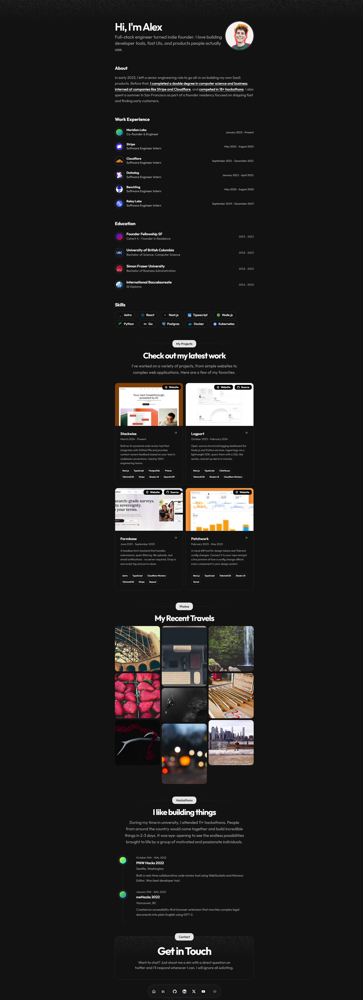

<div align="center">

# Starfolio

**A modern, content-first Astro portfolio** - built with Astro v6, React, Tailwind CSS v4, and shadcn/ui.

[](https://astro.build)
[](https://tailwindcss.com)
[](https://ui.shadcn.com)
[](LICENSE)
[](https://deploy.workers.cloudflare.com/?url=https://github.com/webrating/starfolio)

[**Live Demo**](https://astro-portfolio-template.stackrater.io) · [Report Bug](https://github.com/webrating/starfolio/issues) · [Request Feature](https://github.com/webrating/starfolio/issues)



</div>

## Why Starfolio?

A developer portfolio that keeps the bio, work history, projects, skills, and social links in one typed data file. The interface uses Starfolio's original compact, minimal layout with light and dark themes.

**TL;DR: Edit the resume data and site config, then deploy.**

## Features

- **Astro v6** - static-first, ships zero JS by default
- **Centralized customization** - edit your data and config without hunting through components
- **Homepage customization** - show/hide sections, control all of the homepage content, + lots more
- **Tailwind CSS v4 + shadcn/ui** - modern, accessible UI primitives
- **Light & dark mode** - automatic system detection, theme variables in one place
- **SEO-ready** - meta tags, Open Graph images, sitemap, robots.txt
- **Type-safe** - TypeScript throughout, including your resume data
- **Variable fonts** - swap fonts in seconds via Fontsource
- **Responsive design** - mobile-first, looks great everywhere
- **Cloudflare Pages adapter** - pre-configured, swappable for Vercel / Netlify / Node

## Portfolio content

| File | Controls |
| --- | --- |
| `src/data/resume.tsx` | Your name, bio, work, education, projects, skills, and social links |
| `src/data/config.ts` | Site URL, SEO, theme colors, font size |
| `src/content/project-stories/*.md` | Long-form story for each project |

## Stack

- [Astro v6](https://astro.build) - static site generator
- [React](https://react.dev) - interactive islands
- [Tailwind CSS v4](https://tailwindcss.com) - styling
- [shadcn/ui](https://ui.shadcn.com) - UI components
- [Cloudflare Pages](https://pages.cloudflare.com) - deployment adapter (swappable)
- [pnpm](https://pnpm.io) - package manager

## Quick start

**Prerequisites:** Node.js >= 22.12.0, pnpm

```bash
git clone https://github.com/webrating/starfolio
cd starfolio
pnpm install
pnpm dev
```

Open <http://localhost:4321>.

## Customizing your portfolio

### 1. Personal info - `src/data/resume.tsx`

Edit the `DATA` object:

```ts
export const DATA = {
  name: "Your Name",
  initials: "YN",
  url: "https://yoursite.com",
  location: "Your City",
  description: "One-line bio shown in meta and hero",
  summary: "Longer about section, supports markdown links",
  avatarUrl: "/me.png",        // place image in public/
  ogImage: "/og_image.png",    // OG image for social sharing
  skills: [...],
  navbar: [...],
  contact: { email, social },
  work: [...],
  education: [...],
  projects: [...],
}
```

Replace the placeholder logos in `public/` with your own.

### 2. Site settings - `src/data/config.ts`

```ts
export const CONFIG = {
  site: {
    url: "https://yoursite.com",   // must match astro.config.mjs site
    locale: "en_US",
    twitterHandle: "@yourhandle",
  },
  seo: {
    titleTemplate: "%s | %n",      // %s = page title, %n = your name
    twitterCard: "summary_large_image",
    robots: "index, follow",
  },
  typography: {
    baseFontSize: 100,             // 100 = default, 110 = 10% larger
  },
  theme: {
    radius: "0.625rem",
    light: { background, primary, ... },
    dark:  { background, primary, ... },
  },
}
```

**Changing theme colors:** grab any theme from [ui.shadcn.com/themes](https://ui.shadcn.com/themes) or [tweakcn.com](https://tweakcn.com), copy the CSS variables, and paste them into the `light` / `dark` blocks (strip the `--` prefix, camelCase the property names e.g. `card-foreground` → `cardForeground`).

**Changing font size:** set `baseFontSize` to a percentage - `115` = 15% larger across all text, headings, and links at once.

## Changing fonts

1. Find a variable font at [fontsource.org](https://fontsource.org) (filter by Variable)
2. Install it: `pnpm add @fontsource-variable/<font-name>`
3. In `src/styles/global.css`, swap the `@import` and `--font-sans` value:

```css
@import "@fontsource-variable/inter";
--font-sans: 'Inter Variable', sans-serif;
```

You need both a sans and a mono font. The mono font (`--font-mono`) is used for code blocks. Not every sans font has a matching mono - common pairings:

| Sans | Mono |
| --- | --- |
| `geist` | `geist-mono` |
| `inter` | `jetbrains-mono` |
| `plus-jakarta-sans` | `fira-code` |

## Commands

| Command | Action |
| --- | --- |
| `pnpm install` | Install dependencies |
| `pnpm dev` | Start dev server at `localhost:4321` |
| `pnpm build` | Build for production |
| `pnpm preview` | Preview production build locally |

## Contact form email

The contact form posts to `/api/contact` and sends its message to
`muh.zhafranilham@gmail.com` through Resend.

1. Verify a sending domain in Resend.
2. Copy `.dev.vars.example` to `.dev.vars` and fill in `RESEND_API_KEY` plus
   `CONTACT_FROM_EMAIL` using an address on that verified domain.
3. For Cloudflare production, add `RESEND_API_KEY` as a secret and configure
   `CONTACT_FROM_EMAIL` as an environment variable before deploying.

Never expose the Resend API key in client-side code or commit `.dev.vars`.

## Project stories

The `/blog` route is used as a long-form case-study library for projects. Each
project card links to a Markdown file in `src/content/project-stories/`.

To add a story:

1. Add a project `slug` in `src/data/resume.tsx`, for example `slug: "my-project"`.
2. Create `src/content/project-stories/my-project.md` so the filename matches
   that slug.
3. Fill in the frontmatter below and write the story after it.

```md
---
title: "My Project"
description: "A short summary for the story listing and SEO."
publishedDate: 2026-07-14
projectPeriod: "January 2026 - Present"
technologies:
  - Astro
  - TypeScript
coverImage: "/my-project.webp" # optional; place it in public/
projectUrl: "https://example.com" # optional
sourceUrl: "https://github.com/user/repo" # optional
order: 1
draft: false
---

## Overview

Write the full project story here.
```

Set `draft: true` to keep a story out of the listing and production routes.

## Deployment

Pre-configured for **Cloudflare Workers or Pages** via `@astrojs/cloudflare`. Run `pnpm build` and deploy the `dist/` folder.

To use a different host, swap the adapter in `astro.config.mjs` - see [Astro adapters](https://docs.astro.build/en/guides/deploy/).

Starfolio works with any Astro-supported deploy target: **Vercel**, **Netlify**, **Cloudflare Pages**, **GitHub Pages**, **Node**, or static hosting.

## Project structure

```
src/
├── data/
│   ├── resume.tsx    # Your personal data
│   └── config.ts     # Site settings & theme
├── components/       # UI components (no need to edit)
├── layouts/
│   └── Layout.astro  # HTML shell, reads from config.ts
├── pages/
│   └── index.astro
└── styles/
    └── global.css    # Font imports & Tailwind base
public/               # Static assets (images, favicon)
```

## Contributing

Issues and PRs welcome. If you build something with Starfolio, open an issue with a link - happy to feature it in a "Built with Starfolio" section.

## Show your support

If this template saved you time, please **star the repo** - it helps others find it.

## Credits

- [dillionverma/portfolio](https://github.com/dillionverma/portfolio) - the original, and AMAZING, Next.js portfolio this template is inspired by
- [Astro](https://astro.build), [shadcn/ui](https://ui.shadcn.com), [Tailwind CSS](https://tailwindcss.com)

## License

[MIT](LICENSE) - free for personal and commercial use.

---

<div align="center">

**Keywords:** astro portfolio · personal website · developer portfolio · resume website · astro shadcn · tailwind portfolio

</div>
